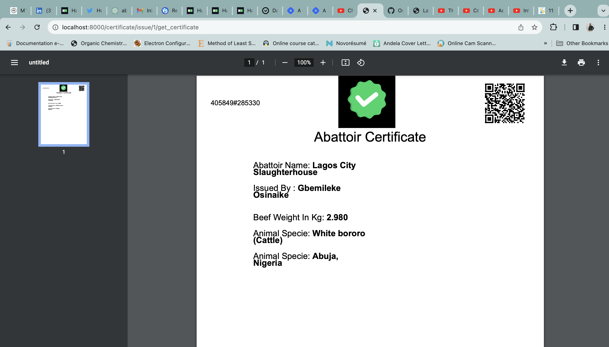

# abattoirs
A project in the agricultural sector that checks the protein consumption of consumers like meat in a particular abattoir by issuing certificates which has the details of the slaughtered animal. In turn consumers can scan the certificate at every restaurant or outlet to verify the authenticity of the protein food.

https://documenter.getpostman.com/view/15795679/2s93shzVTy link to the postman documentation.

Certificate builder:
